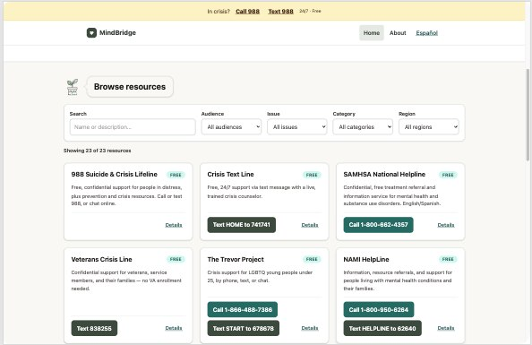

# MindBridge

A free directory of U.S. mental-health crisis lines and support resources, in English and Spanish.

**Live:** [English](https://mindbridge.leixue.dev/) · [Español](https://mindbridge.leixue.dev/es)



> **In immediate danger, call 911.** For crisis support, call or text **988** (24/7, free). MindBridge is an information directory, not a substitute for professional care.

## Features

- Filter resources by keyword, audience, issue, category and region
- California search by county or ZIP, with official county mental-health contacts
- Optional location-based county suggestion (coordinates are never stored)
- Crisis options like 988 always visible

**Tech:** React, TypeScript, Vite, Tailwind CSS, Cloudflare Workers

## Run locally

```bash
npm ci
npm run worker:dev   # terminal 1: local API for the LA County search
npm run dev          # terminal 2: the app
npm test             # tests
npm run build        # production build
```

More detail (data sources, deployment, data updates): [docs/details.md](docs/details.md)
